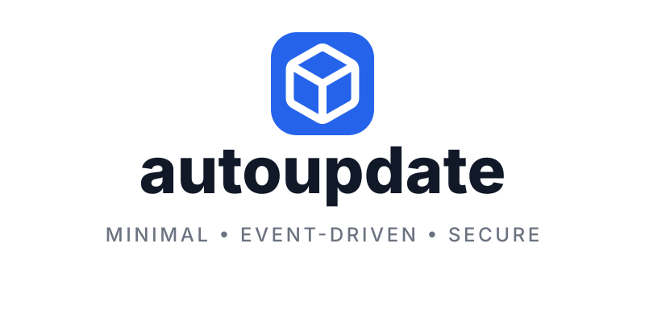
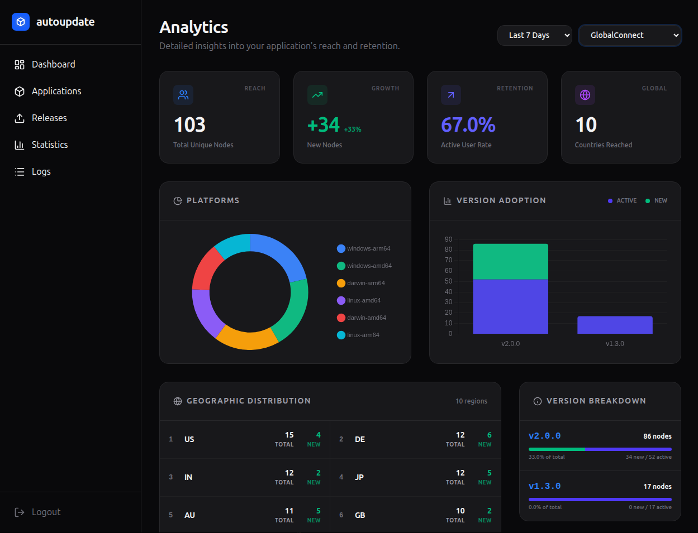
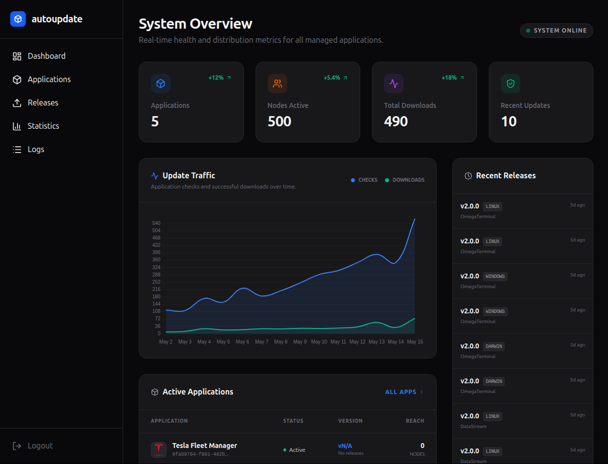
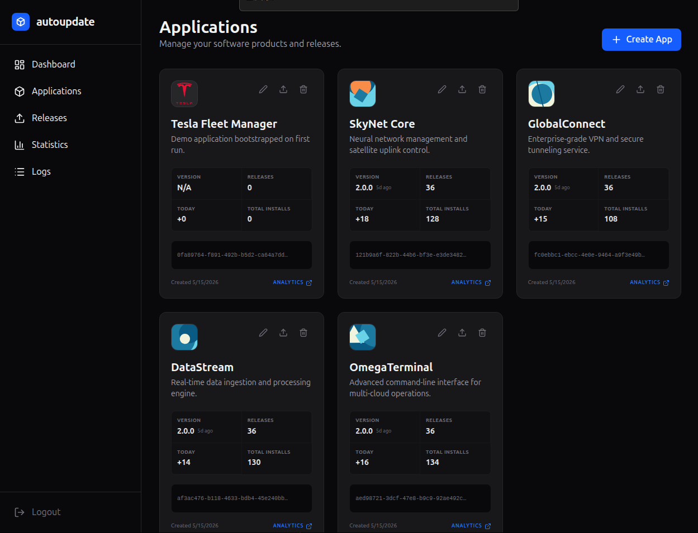
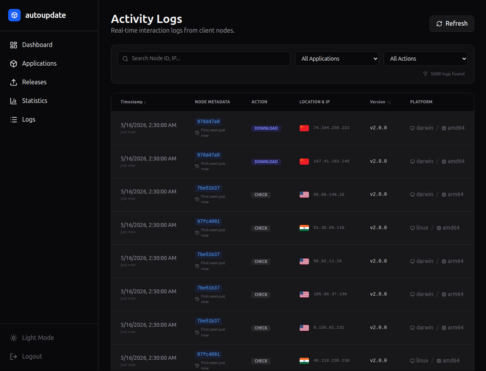

<div align="center">
  <picture>
    <source media="(prefers-color-scheme: dark)" srcset="images/banner-dark.svg">
    <source media="(prefers-color-scheme: light)" srcset="images/banner-light.svg">
    
  </picture>
  <p><strong>autoupdate &mdash; Minimal, event-driven Go library for binary self-updates and optional self-hosted update server with real-time analytics.</strong></p>

  <p>
    <a href="https://pkg.go.dev/github.com/lesterkaufungen/autoupdate"></a>
    
    
  </p>
</div>

---

**`autoupdate`** is a complete, production-ready Golang toolkit for binary lifecycle management. It is built to support two primary deployment models:

1. **The OSS / Provider Way (Client-Only):** Easily embed automatic, self-updating capabilities into your Golang CLI tools, background services, or desktop apps. Connect directly to public or private providers like **GitHub, GitLab, or Gitea** to keep your applications automatically up-to-date with minimal integration effort.
2. **The Self-Hosted Way (Server + Analytics):** Deploy the robust, built-in update server to manage your own private binary distribution infrastructure. Serve updates directly from an embedded SQLite WAL database and access a modern dashboard featuring deep, real-time analytics on active node retention, version adoption, and geographic reach.

Whether you need a drop-in self-update library backed by GitHub Releases, or a complete, self-hosted distribution platform with telemetry, `autoupdate` provides a minimal, event-driven, and thread-safe architecture.

<div align="center">
  <picture>
    <source media="(prefers-color-scheme: dark)" srcset="screenshots/analytics-dark.png">
    <source media="(prefers-color-scheme: light)" srcset="screenshots/analytics-light.png">
    
  </picture>
</div>

<details>
  <summary><b>Dashboard</b></summary>
  <div align="center">
    <br/>
    <picture>
      <source media="(prefers-color-scheme: dark)" srcset="screenshots/dashboard-dark.png">
      <source media="(prefers-color-scheme: light)" srcset="screenshots/dashboard-light.png">
      
    </picture>
  </div>
</details>

<details>
  <summary><b>Applications</b></summary>
  <div align="center">
    <br/>
    <picture>
      <source media="(prefers-color-scheme: dark)" srcset="screenshots/applications-dark.png">
      <source media="(prefers-color-scheme: light)" srcset="screenshots/applications-light.png">
      
    </picture>
  </div>
</details>

<details>
  <summary><b>Logs</b></summary>
  <div align="center">
    <br/>
    <picture>
      <source media="(prefers-color-scheme: dark)" srcset="screenshots/logs-dark.png">
      <source media="(prefers-color-scheme: light)" srcset="screenshots/logs-light.png">
      
    </picture>
  </div>
</details>

## 🚀 Key Features

### 📦 Client Library
- **Universal Platform Support:** Works seamlessly across **Windows**, **Linux**, and **macOS**.
- **Versatile Binary Updates:** Supports any binary type, including CLI tools, background services, and even **macOS .app bundles**.
- **Multiple Update Sources:** Native support for **GitHub**, **GitLab**, **Gitea**, and custom **Generic** servers.
- **Two Operation Modes:**
  - **Self-Update:** The application watches and updates its own binary.
  - **External Watcher:** Acts as a supervisor for child processes, managing their lifecycle and updates.
- **Event-Driven API:** Subscribe to update events via Go channels or callbacks.
- **Production-Safe Updates:**
  - Mandatory **SHA-256** verification.
  - Platform-specific update scripts (`sh` for Unix and Mac, `ps1` for Windows).
  - Detached process restart and cleanup.
- **Service Integration:** Supports restarting via systemd, launchd, or Windows Services.
- **LauncherPipe:** Stream communication directly into child process `stdin`.

### 🖥️ Update Server (Optional)
- **Multi-Tenancy:** Manage multiple users and applications from a single instance.
- **Built-in Analytics:** 
  - Track unique nodes, versions, and architectures.
  - **Retention Tracking:** Identify New vs. Active users.
  - **GeoIP Support:** Integrated MaxMind GeoIP for geographic distribution.
- **Advanced Storage:** 
  - **SQLite Blob Strategy:** Stores binaries directly in SQLite using WAL mode for high performance and zero external dependencies.
  - **Atomic Writes:** Thread-safe and robust concurrent write handling.
- **Admin Dashboard:** Modern Svelte-based UI for managing releases and monitoring logs.
- **Framework Agnostic:** Easy integration with **Gin**, **Echo**, or standard `net/http`.

---

## 🛠️ Installation

```bash
go get github.com/lesterkaufungen/autoupdate
```

---

## 📚 Documentation

Detailed documentation for various parts of the project:

- **[Usage Guide (USAGE.md)](./docs/USAGE.md)**: Comprehensive guide with examples for integrating the `autoupdate` library and setting up the server.
- **[REST API Reference (API.md)](./docs/API.md)**: Detailed specification of the HTTP API provided by the update server.
- **[Dashboard Reference (DASHBOARD.md)](./docs/DASHBOARD.md)**: Overview of the built-in management dashboard and its features.
- **[Frontend Specification (FRONTEND.md)](./docs/FRONTEND.md)**: Technical details about the Svelte-based management UI and its build process.
- **[AI Agent Context (AGENTS.md)](./AGENTS.md)**: Instructions and context for AI coding agents working on this codebase.
- **[Gemini Guidelines (GEMINI.md)](./GEMINI.md)**: Specialized instructions for the Gemini CLI agent.
- **[Claude Guidelines (CLAUDE.md)](./CLAUDE.md)**: Best practices and guidelines for using Claude with this project.

---

## 📖 Library Usage

### 1. Self-Update (GitHub)
Monitor a GitHub repository for new releases and update the running binary automatically.

```go
package main

import (
    "log"
    "time"
    "github.com/lesterkaufungen/autoupdate"
)

func main() {
    watcher, err := autoupdate.Watch(autoupdate.WatchConfig{
        Source:      autoupdate.NewGitHubSource("org", "repo", ""),
        Version:     "1.0.0",
        SelfUpdate:  true,
        AutoRestart: true,
        Interval:    time.Hour,
    })
    if err != nil {
        log.Fatal(err)
    }

    // Subscribe to events
    watcher.OnUpdate(func(event autoupdate.UpdateEvent) {
        log.Printf("Event: %s - Version: %s", event.Type, event.Version)
    })

    // Keep application running
    select {}
}
```

### 2. External Watcher (Supervisor)
Run an external binary and update it whenever a new version is released.

```go
watcher, err := autoupdate.Watch(autoupdate.WatchConfig{
    Target:      "./my-service",
    Args:        []string{"--port", "8080"},
    Source:      autoupdate.NewGenericSource("https://updates.example.com", "app-uuid", nil),
    AutoRestart: true,
})
```

---

## 🏗️ Update Server Setup

The update server can be run as a standalone service or embedded into your existing Go application.

### Standalone Installation
Install the pre-built server binary directly using Go:

```bash
go install github.com/lesterkaufungen/autoupdate/cmd/autoupdate-server@latest
```

### Embedding in Gin
```go
import (
    "github.com/lesterkaufungen/autoupdate"
    "github.com/lesterkaufungen/autoupdate/server"
    "github.com/gin-gonic/gin"
)

func main() {
    r := gin.Default()
    config := server.Config{
        DatabasePath: "./autoupdate.db",
        StoragePath:  "./binaries",
    }
    
    autoupdate.Gin(r, config)
    r.Run(":8080")
}
```

### Server Architecture
- **SQLite WAL Mode:** Ensures high concurrency for both analytics logging and binary serving.
- **Blob Storage:** By storing binaries as blobs in dedicated app-specific SQLite files, the server remains portable and easy to back up.
- **Real-time Updates:** Uses WebSockets to stream analytics and logs to the Admin UI.

---

## 📊 Analytics & Monitoring

The built-in dashboard provides deep insights into your binary distribution:

- **Node ID Tracking:** Identifies unique installations across updates.
- **Version Distribution:** See exactly which versions your users are running.
- **Geographic Insights:** Heatmap of user locations via IP-to-Country mapping.
- **Success Rates:** Monitor update check vs. download success/failure logs.

---

## 🔒 Security & Reliability

- **SHA-256 Checksums:** Every update is verified against its hash before being moved into place.
- **Detached Execution:** The update script runs independently of the main application, ensuring that even if the process is killed, the update completes and restarts.
- **Thread Safety:** The watcher and server are designed for concurrent environments, using robust locking and SQLite's concurrency features.

---

## 🗺️ Roadmap

### 📦 Implemented
- [x] **Multi-Source Support:** Seamless updates from GitHub, GitLab, and Gitea.
- [x] **Self-Hosted Update Server:** Robust Go-based server for private binary distribution.
- [x] **Real-time Analytics:** Node tracking, version distribution, and GeoIP reach.
- [x] **Event-Driven Library:** Flexible channel and callback-based update monitoring.
- [x] **Admin Dashboard:** Modern Svelte 5 UI for managing apps and releases.
- [x] **Secure Updates:** Mandatory SHA-256 verification and detached execution.

### 🚀 Upcoming
- [ ] **Standalone Supervisor Client:** A dedicated binary to manage, monitor, and update external services via config files or CLI arguments.
- [ ] **Multi-Language Support:** Client libraries for **Rust, Node.js, Python, Java, Swift, and C++** to make the update ecosystem truly universal.
- [ ] **Advanced Rollout Strategies:** Support for canary releases and staged rollouts in the update server.
- [ ] **Time Synchronization:** Client-server time synchronization for client time-critical updates.

---

## 📄 License

MIT License. See [LICENSE](LICENSE) for details.
